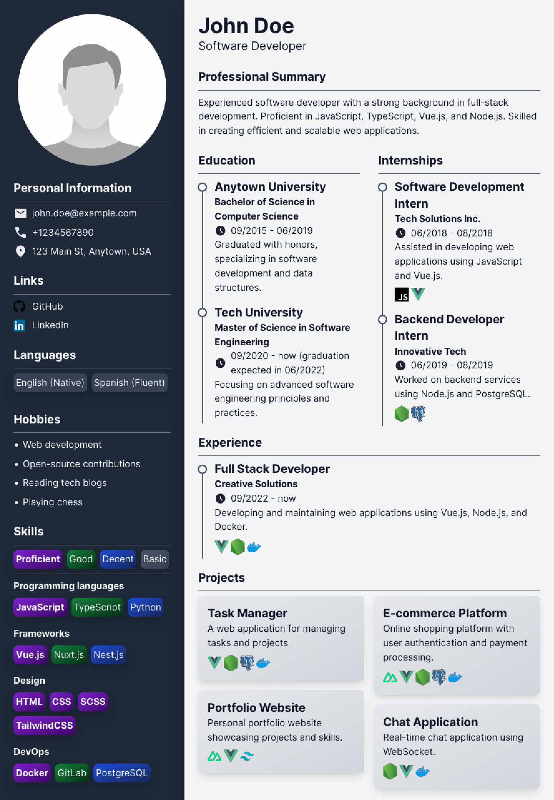

# Krane Nuxt CV



## Clone the repository
It does not matter which one of the following options you pick, they are just mirrors.

GitHub:

`git clone https://github.com/LeeKrane/krane-nuxt-cv.git`

GitLab:

`git clone https://gitlab.com/LeeKrane/krane-nuxt-cv.git`

GitLab self-managed:

`git clone https://gitlab.kradev.net/krane/krane-nuxt-cv.git`

## Navigate to the project directory
`cd krane-nuxt-cv`

## Install dependencies
`bun i` or `npm i`

## Create your data

Rename the file `assets/cv-data-template.json` to `assets/cv-data.json` and fill in your data.

If you don't know what to put in the `cv-data.json` file, you can look into the `assets/cv-data-example.json` file to see how the JSON data to the presentation in the file `example-cv.pdf` looks like.

Available skill levels and meanings (`skills[x].list[y].level`):

```
0 - proficient
1 - good
2 - decent
3 - basic
```

Available tech stack items (`[internships | experience | projects][x].techStack`):

!! non-case-sensitive !!

```
DaisyUI
Discord.js
Docker
GitLab
Java
Nest.js
Nextcloud
Node.js
Nuxt.js
PiHole
Portainer
PostgreSQL
Python
RaspberryPi
RockyLinux
SCSS
SpringBoot
TailwindCSS
Vue.js
WireGuard
```

## Add your avatar
Place your profile picture (square) here: `public/avatar.png`

## Start the development server
`bun run dev` or `npm run dev`

Your resume is now available under http://localhost:3000/

## Generate a PDF
Print to PDF from the browser (CTRL + P for Firefox), disable headers and footers, enable backgrounds, set margins to None and play around with the scaling to get the perfect single page fit.     
